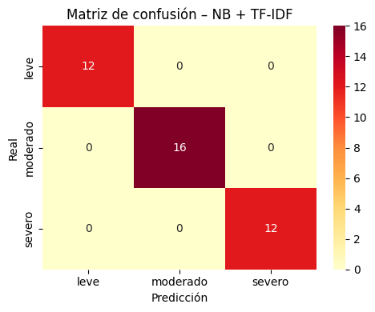
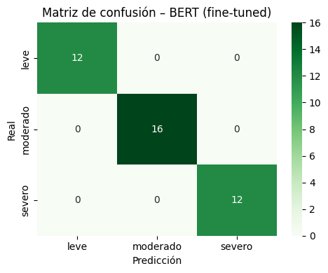
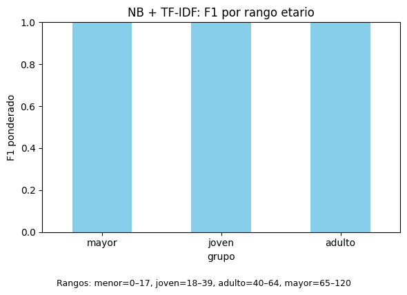
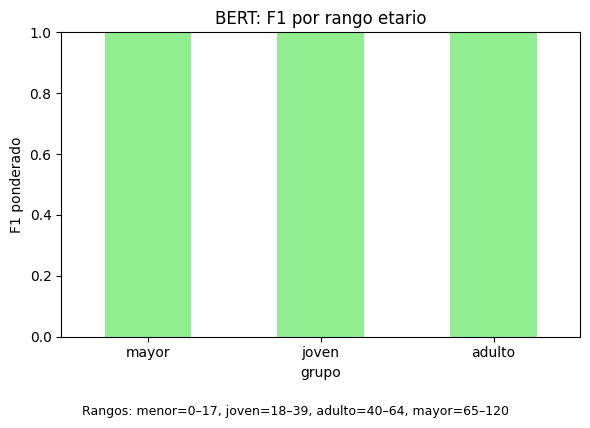

# Módulo 8 — Evaluación Modular: Clasificación de notas clínicas

[](
  https://colab.research.google.com/github/covalenzuela/bootcamp-ml-2025/blob/main/modules/m08_nlp/evaluacion_modular/notebooks/clasificacion_notas_clinicas.ipynb
)

**Objetivo.** Clasificar la **gravedad** de notas clínicas (leve / moderado / severo) con un baseline clásico (**TF-IDF + Naive Bayes**) y una variante moderna con **BERT** (fine-tuning opcional).

---

## Datos
- **Archivo local:** `../data/raw/dataset_clinico_simulado_200.csv` *(no se versiona en GitHub)*.  
- **Columnas esperadas:** `texto_clinico, edad, genero, afeccion, gravedad`.  
- **Clases:** leve, moderado, severo.  
- **Split:** 80/20 estratificado (`random_state=42`) → 160 filas de train, 196 features TF‑IDF.
- **Stats del preprocesamiento:** longitud media ≈ **6.95** tokens; vocabulario ≈ **70.0**; palabras totales ≈ **1390.0**.

---

## Pipeline
1. Limpieza y normalización (regex, minúsculas, stopwords ES).
2. **TF‑IDF** sobre `texto_proc` y modelo **MultinomialNB**.
3. Métricas (accuracy, **macro‑F1**), matriz de confusión y **top‑k palabras** por clase (interpretabilidad).
4. (**Opcional**) **BERT**: `BertForSequenceClassification` + tokenizer; comparación NB vs BERT.
5. (**Opcional**) **Fairness** por subgrupos (p.ej. `genero`): accuracy/F1 macro por grupo.

### Descarga automatizada (opcional, si no tienes el CSV local)
```python
# Ejecuta en el notebook
import os, gdown
os.makedirs("../data/raw", exist_ok=True)
FILE_ID = "1pWlNKW31-MDEr6D8eNICjkadwLGeX2BR"  # Reemplaza por tu ID de archivo en Drive
gdown.download(f"https://drive.google.com/uc?id={FILE_ID}",
               "../data/raw/dataset_clinico_simulado_200.csv",
               quiet=False)
```

---

## Instalación (solo este módulo)
```bash
pip install -r requirements.txt
python -m spacy download es_core_news_sm   # si usarás lematización en español
```

## Ejecución
1) Abrir `notebooks/clasificacion_notas_clinicas.ipynb` (Colab o local).  
2) Pipeline: **EDA → Preproc → TF-IDF → NB → (BERT opc.) → Métricas → Figuras**.  
3) Exporta figuras a `reports/figures/`.

---

## Resultados (notebook actual)
**Reporte por clase — NB + TF‑IDF**
```
precision  recall  f1-score  support
leve       1.000    1.000    1.000   12
moderado   1.000    1.000    1.000   16
severo     1.000    1.000    1.000   12

accuracy                       1.000   40
macro avg  1.000    1.000    1.000   40
weighted   1.000    1.000    1.000   40
```

**Reporte por clase — BERT fine‑tuned**
```
precision  recall  f1-score  support
leve       1.000    1.000    1.000   12
moderado   1.000    1.000    1.000   16
severo     1.000    1.000    1.000   12

accuracy                       1.000   40
macro avg  1.000    1.000    1.000   40
weighted   1.000    1.000    1.000   40
```

**Comparativa NB vs BERT**
| Modelo          | Accuracy | F1_macro |
|-----------------|:--------:|:--------:|
| NB + TF‑IDF     | 1.000    | 1.000    |
| BERT fine‑tuned | 1.000    | 1.000    |

> *Nota:* puntajes **1.000** en todas las clases sugieren un dataset **muy lineal/separable** o **de bajo ruido** (simulado). Aun así, conviene revisar **sanity checks**: sin fuga de datos, split estratificado, textos duplicados, y semilla fija.

**Figuras**:

<!-- 2 matrices lado a lado -->
<p align="center">
  
  
</p>

<!-- Fairness lado a lado -->
<p align="center">
  
  
</p>

> **Nota:** en este dataset simulado ambos modelos alcanzan 1.000 en todas las métricas; no se observan brechas por edad.


---

## Fairness / Sesgos (estratificación)

- Reporta métricas **estratificadas por `genero` y/o rangos de `edad`** (Accuracy, Recall/F1 por subgrupo).  
- Señala **posibles sesgos** (p. ej., peor F1 en un subgrupo).  
- **Mitigaciones** sugeridas: `class_weight`, umbrales por clase, aumento de datos minoritarios, auditorías por subgrupo.

**NB + TF‑IDF por género**
```
grupo  precision_w  recall_w  f1_w  soporte
M      1.0          1.0       1.0   22
F      1.0          1.0       1.0   18
```

**NB + TF‑IDF por rango etario**
```
grupo   precision_w  recall_w  f1_w  soporte
mayor   1.0          1.0       1.0   15
joven   1.0          1.0       1.0   14
adulto  1.0          1.0       1.0   11
```

**BERT fine‑tuned por género**
```
grupo  precision_w  recall_w  f1_w  soporte
M      1.0          1.0       1.0   22
F      1.0          1.0       1.0   18
```

**BERT fine‑tuned por rango etario**
```
grupo   precision_w  recall_w  f1_w  soporte
mayor   1.0          1.0       1.0   15
joven   1.0          1.0       1.0   14
adulto  1.0          1.0       1.0   11
```

**Comentario:** en este conjunto simulado, **no se observan brechas** de desempeño por subgrupos. En escenarios reales, monitorizar **F1 por subgrupo**, balance de clases y aplicar mitigaciones (p. ej., `class_weight`, aumento de datos minoritarios, auditorías por grupo).

---

## Explicabilidad
- Incluir 1–3 ejemplos con **LIME** o **SHAP** (texto resaltado con tokens más influyentes).  
- Discutir riesgos de sobreinterpretación y uso responsable (datos clínicos simulados, no diagnóstico).

#### Ejemplo cualitativo

**Texto:** `urgencia médica tos asociado fractura muñeca crítica`  
**Etiqueta real:** `severo`

- **[NB]** Predicción: `severo` *(p = 0.92)*  
  **Top features (peso relativo)**

  | token     | peso    |
  |-----------|---------|
  | médica    | -0.032  |
  | urgencia  | -0.030  |
  | fractura  | -0.021  |
  | asociado  | -0.021  |
  | crítica   | -0.020  |
  | muñeca    | -0.020  |
  | tos       | +0.004  |

- **[BERT]** Predicción: `severo` *(p = 0.70)*  
  **Top features (peso relativo)**

  | token     | peso    |
  |-----------|---------|
  | médica    | -0.090  |
  | crítica   | -0.074  |
  | fractura  | -0.027  |
  | muñeca    | -0.016  |
  | urgencia  | -0.016  |
  | tos       | -0.015  |
  | asociado  | +0.002  |

> **Cómo leer los pesos:** mayor **magnitud** ⇒ mayor influencia del token en la decisión; el **signo** indica dirección relativa respecto de la clase predicha. Úsalo como guía cualitativa (no clínicamente concluyente).

---

## Reproducibilidad
- **Semillas**: usar `random_state=42`; helper opcional `shared/src/utils.py::set_seed(42)`.  
- **Versiones**: ver `requirements.txt`. Si usas Torch CPU:
```bash
pip install torch --index-url https://download.pytorch.org/whl/cpu
```

---

## Ética
Datos **simulados** y de uso docente; este proyecto **no es** un sistema de diagnóstico.

---

## Créditos y licencia
- **Autores**: Aliwen Delgado, Constanza Valenzuela, Jose Miguel Ortiz, Viviana Molina.  
- **Licencia**: MIT (ver `LICENSE` en la raíz del repo).
